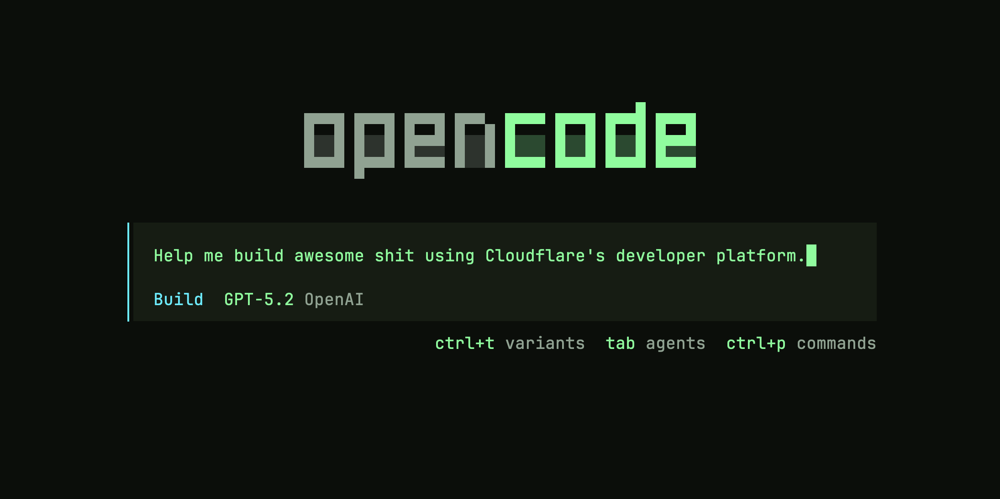

<!--
title: Building on Cloudflare
description: OpenCode turns Cloudflare into a candy store for developers.
keywords: []
publish_date: 2026-01-26
kind: project
-->


[](https://opencode.ai/)

[OpenCode](https://opencode.ai/) is my new favorite tool for hacking. It's an open-source AI agent that can help you research, plan, and build software. In this post I'll show you how to set it up with some good defaults so you can start building on Cloudflare's developer platform right away.

Most imporantly, **OpenCode is a remedy for FOMO** (fear of missing out). The world is moving fast, but OpenCode helps you keep up.

If you don't wanna read this whole thing, here's a [one-liner](https://github.com/zeke/sweet-sweet-opencode) to get you going:

```bash
npx zeke/sweet-sweet-opencode
```

If you'd prefer to go through the process step by step, then read on...

## Cloudflare has so many products 😱

Cloudflare's developer platform has everything you need to build web apps: [Workers](https://developers.cloudflare.com/workers/) for serverless deployment, [R2](https://developers.cloudflare.com/r2/) for object storage, [D1](https://developers.cloudflare.com/d1/) for serverless databases. But there are [over 100 other products](https://developers.cloudflare.com/directory/) on the developer platform. 

Here are a few examples you might not have heard of:

- [Agents](https://developers.cloudflare.com/agents/) for deploying AI agents that can interact with tools and services.
- [Sandboxes](https://developers.cloudflare.com/sandbox/) for running untrusted code in isolated environments.
- [Browser Rendering](https://developers.cloudflare.com/browser-rendering/) for headless browsers in the cloud.
- [Turnstile](https://developers.cloudflare.com/turnstile/) for privacy-first bot protection without CAPTCHAs.

What are all these products and how do you use them?

Answering a question like this used to be a daunting task (at least for me), but now we have AI agents to help us research, plan, and build. What was once an overwhelming array of options now feels like a candy store of possibilities.

## 1: Sign in to Cloudflare

Sign into the Cloudflare dashboard at [dash.cloudflare.com](https://dash.cloudflare.com/). If you don't already have an account, you can easily create one using your Google, Apple, or GitHub account.

Cloudflare is free to start, with very generous limits before you have to start paying for anything.

## 2: Authenticate

[Wrangler](https://developers.cloudflare.com/workers/wrangler/) is Cloudflare's command-line interface. You can run it with npx, which is included with Node.js. (Install Node.js with `brew install node` if you don't already have it installed.)

Run this command to authenticate your Cloudflare account:

```bash
npx -y wrangler login
```

This will open a browser window prompting you to authorize Wrangler to access your Cloudflare account.

## 3: Install OpenCode

There are [several ways to install OpenCode](https://opencode.ai/docs/#install), but here we'll use Homebrew:

```bash
brew install anomalyco/tap/opencode
```

## 4: Add Cloudflare's docs server

Cloudflare has [a handful of official MCP servers](https://developers.cloudflare.com/agents/model-context-protocol/mcp-servers-for-cloudflare/) that expose various tools to your OpenCode agent. The one we're interested in is the [Cloudflare Documentation MCP server](https://github.com/cloudflare/mcp-server-cloudflare/tree/main/apps/docs-vectorize), which exposes a tool for searching Cloudflare's documentation from OpenCode.

There are a couple ways to install MCP servers in OpenCode. Here we'll manually edit your OpenCode configuration file (usually located at `~/.config/opencode/opencode.json`) to add the Cloudflare Docs MCP server:

```json
{
  "$schema": "https://opencode.ai/config.json",
  "mcp": {
    "cloudflare-docs": {
      "type": "remote",
      "url": "https://docs.mcp.cloudflare.com/sse",
      "enabled": true
    }
  }
}
```

## 5: Start OpenCode

Now you've got everything set up. It's time to fire up an OpenCode session.

Open your terminal, then navigate to an existing project or create a new directory:

```sh
mkdir my-new-app && cd my-new-app
```

Then start opencode:

```sh
opencode
```

Now hit `Tab` on your keyboard to switch to **Plan** mode. This will let you collaborate with the agent on a plan before actually creating or editing any files.

Then type a query to get the conversation going. Here are some examples:

> How do Cloudflare agents and sandboxes work together?

> Can I use Cloudflare to process emails?

> Do Cloudflare Workers costs depend on response sizes? I want to serve some images (map tiles) from an R2 bucket and I'm concerned about costs.

> How many indexes are supported in Workers Analytics Engine? Give an example using the Workers binding API.

## Extra credit

The OpenCode config above can also include optional (disabled by default) MCP servers for Replicate and the Cloudflare API.

1. Create a Replicate API token

- Go to https://replicate.com/account/api-tokens
- Create a token and copy it
- Add it to your environment:

```bash
export REPLICATE_API_TOKEN="your_token_here"
```

2. Create a Cloudflare API token

- Go to https://dash.cloudflare.com/profile/api-tokens
- Create a token and copy it
- Add it to your environment:

```bash
export CLOUDFLARE_API_TOKEN="your_token_here"
```

3. Enable the MCP servers in OpenCode

Edit your OpenCode config (usually `~/.config/opencode/opencode.json`) and set these to `true`:

- `mcp.replicate-code-mode.enabled`
- `mcp.cloudflare-api.enabled`
